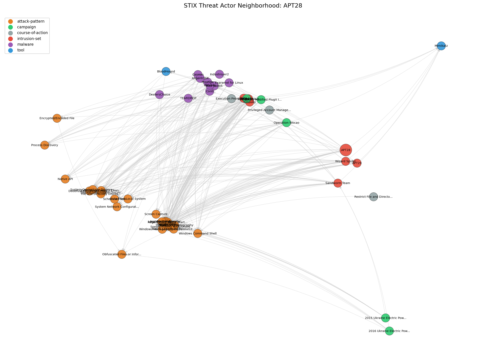

# stix2nx

Convert STIX cyber threat intelligence bundles to NetworkX graphs.

## Installation

```bash
pip install stix2nx
```

## Quick Start

```python
from stix2nx import stix_to_graph

# Convert a STIX bundle file to a NetworkX graph
G = stix_to_graph("enterprise-attack.json")

print(f"{len(G.nodes)} nodes, {len(G.edges)} edges")
# → 15,058 nodes, 25,383 edges
```

## Before / After

**Before (without stix2nx):**

```python
import json
import networkx as nx

with open("enterprise-attack.json") as f:
    bundle = json.load(f)

G = nx.MultiDiGraph()

for obj in bundle["objects"]:
    if obj["type"] == "relationship":
        G.add_edge(
            obj["source_ref"],
            obj["target_ref"],
            relationship_type=obj["relationship_type"],
            id=obj["id"],
            **{k: v for k, v in obj.items()
               if k not in ("type", "source_ref", "target_ref", "id")},
        )
    elif obj["type"] == "sighting":
        G.add_node(obj["id"], **obj)
        if "sighting_of_ref" in obj:
            G.add_edge(obj["id"], obj["sighting_of_ref"],
                       relationship_type="sighting_of")
        for ref in obj.get("where_sighted_refs", []):
            G.add_edge(obj["id"], ref, relationship_type="seen_by")
        for ref in obj.get("observed_data_refs", []):
            G.add_edge(obj["id"], ref, relationship_type="observed")
    elif obj["type"] in ("marking-definition", "language-content"):
        continue
    else:
        G.add_node(obj["id"], **obj)
        # Don't forget STIX 2.0 embedded SCOs in observed-data...
        if obj["type"] == "observed-data" and "objects" in obj:
            for key, embedded in obj["objects"].items():
                synthetic_id = f"{obj['id']}--embedded-{key}"
                G.add_node(synthetic_id, **embedded, id=synthetic_id)
```

**After (with stix2nx):**

```python
from stix2nx import stix_to_graph

G = stix_to_graph("enterprise-attack.json")
```

## API Reference

### `stix_to_graph(source, graph_type="multidigraph", include_scos=True)`

**Parameters:**

- **`source`**: `str | list[str] | list[dict]`
  - **File path** (`str` ending in `.json` or existing file): reads and parses a single STIX bundle file
  - **Directory path** (`str` pointing to an existing directory): globs all `*.json` files in the directory, merges into one graph
  - **`list[str]`**: each string is parsed as a full STIX bundle JSON
  - **`list[dict]`**: each dict is treated as a parsed STIX bundle

- **`graph_type`**: `"multidigraph"` (default) | `"digraph"`
  - `MultiDiGraph` allows multiple edges between the same pair of nodes, which is technically correct for STIX (a threat actor can both "uses" and "attributed-to" the same malware). However, some NetworkX algorithms (like certain centrality measures) only work on simple DiGraphs. Choose based on your use case.

- **`include_scos`**: `bool` (default `True`)
  - When `True`, STIX Cyber-observable Objects (IP addresses, domain names, file hashes, etc.) become nodes. When `False`, only SDOs and relationships are included.

- **Returns**: `nx.MultiDiGraph` or `nx.DiGraph`

## Graph Structure

STIX objects map to graph elements as follows:

| STIX Object | Graph Element | Details |
|---|---|---|
| SDOs (threat-actor, malware, etc.) | Nodes | All properties become node attributes |
| SCOs (ipv4-addr, file, etc.) | Nodes | When `include_scos=True` |
| Relationships | Directed edges | `relationship_type`, `start_time`, `stop_time`, `confidence` as attributes |
| Sightings | Nodes + edges | `sighting_of`, `seen_by`, `observed` edges |
| Marking definitions | Skipped | Not added to the graph |
| Language content | Skipped | Not added to the graph |

All STIX properties on objects are preserved as NetworkX attributes. List-valued properties remain Python lists.

## Working with the Graph

```python
from stix2nx import stix_to_graph

G = stix_to_graph("enterprise-attack.json")
```

**Find all techniques used by APT28:**

```python
apt28 = [n for n, d in G.nodes(data=True) if d.get("name") == "APT28"][0]
techniques = [
    G.nodes[target]["name"]
    for _, target, data in G.edges(apt28, data=True)
    if data.get("relationship_type") == "uses"
    and G.nodes[target].get("type") == "attack-pattern"
]
```

**Most connected threat actors (by degree):**

```python
actors = [(n, G.degree(n)) for n, d in G.nodes(data=True) if d["type"] == "intrusion-set"]
top_actors = sorted(actors, key=lambda x: x[1], reverse=True)[:10]
```

**Merge multiple bundles:**

```python
G = stix_to_graph("/path/to/stix-bundles/")  # all .json files in directory
```

**Use a DiGraph for algorithm compatibility:**

```python
G = stix_to_graph("enterprise-attack.json", graph_type="digraph")
centrality = nx.betweenness_centrality(G)
```

## Visualization



Generated with [`examples/visualize_attack.py`](examples/visualize_attack.py), which extracts a 2-hop neighborhood around APT28 from the ATT&CK dataset and color-codes nodes by type.

## Running Tests

```bash
# Install dev dependencies
pip install -e ".[dev]"

# Run all tests (uses curated ATT&CK subset, no network needed)
pytest

# Run integration test with full live ATT&CK bundle (~30MB download)
STIX2NX_LIVE_ATTACK=true pytest tests/test_attack.py -v

# Regenerate the curated subset from latest ATT&CK (requires network)
python tests/data/build_subset.py
```

## STIX Version Support

Supports both STIX 2.0 and STIX 2.1 bundles. STIX 2.0 `observed-data` objects with embedded observables are automatically extracted as standalone nodes when `include_scos=True`.

## License

MIT
